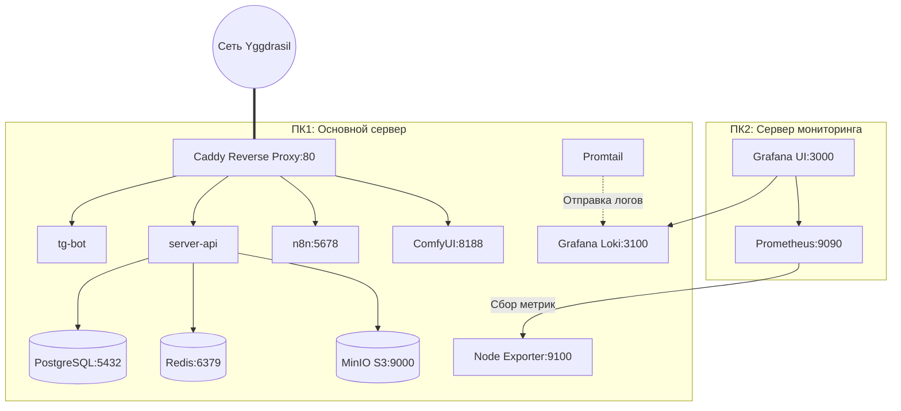

# Руководство администратора по развертыванию инфраструктуры (Admin Guide)

Данное руководство содержит полную информацию по развертыванию, конфигурации, тестированию и мониторингу распределенной AI-инфраструктуры для Telegram-бота генерации изображений.

---

## 1. Архитектура системы

Инфраструктура разделена на два физических сервера (ПК):
1. **ПК1 (Основной сервер приложений / pc1-server)** — содержит базу данных, кэш/очередь, S3-хранилище, AI-движки (ComfyUI), веб-сервер Caddy, n8n-сценарии и логику приложений.
2. **ПК2 (Сервер мониторинга / pc2-monitor)** — содержит стек сбора логов, метрик и визуализации (Loki, Prometheus, Grafana).



### Сетевое взаимодействие
* **Внешний доступ**: ПК1 доступен по протоколу IPv6 через децентрализованную mesh-сеть **Yggdrasil**. Caddy проксирует внешние запросы к API, ComfyUI и n8n.
* **Взаимодействие ПК1 <-> ПК2**: Осуществляется через локальную сеть (LAN IP-адреса). Prometheus на ПК2 собирает метрики Node Exporter с ПК1, а Promtail на ПК1 шлет логи в Loki на ПК2.
* **Изоляция компонентов**: Все базы данных, Redis и MinIO работают во внутренней Docker-сети `pc1-server_app_network` и не опубликованы вовне.

---

## 2. Системные требования и Характеристики серверов

### ПК1 (Сервер приложений / pc1-server):
* **Аппаратные спецификации (Хост)**:
  * **CPU**: Intel Xeon E5-2696 v4 (20 ядер / 40 потоков, 2.20GHz).
  * **RAM**: 48 GB DDR4.
  * **GPU**: NVIDIA Tesla P40 (24 GB VRAM).
  * **OS**: Debian GNU/Linux 12 (bookworm).
* **Необходимое ПО**: Docker Engine 24.0+, Docker Compose v2.20+, NVIDIA Container Toolkit.
* **Python**: 3.10+ (для локального запуска Smoke-тестов).

### ПК2 (Сервер мониторинга / pc2-monitor):
* **Аппаратные спецификации**: 
  * Физическая машина в локальной сети с ОС Linux.
* **Необходимое ПО**: Docker Engine, Docker Compose.
* **Сетевой доступ**: Доступность портов 3000 (Grafana), 9090 (Prometheus), 3100 (Loki) с ПК1.

---

## 3. Развертывание и Запуск

### Шаг 1: Подготовка директорий и данных
На хост-системах необходимо создать директории для монтирования томов. Пути настраиваются в файлах `.env`.
Пример структуры директорий на хосте:
* `/srv/app-data/postgres` — файлы СУБД.
* `/srv/app-data/minio` — медиафайлы S3.
* `/srv/app-data/n8n` — сценарии автоматизации.
* `/srv/storage-models/models` — папка моделей ComfyUI (сюда нужно заранее загрузить веса моделей, например `sd_xl_refiner_1.0.safetensors`).

### Шаг 2: Настройка переменных окружения

В директориях [compose/pc1-server/](compose/pc1-server) и [compose/pc2-monitor/](compose/pc2-monitor) скопируйте `.env.example` в `.env` и отредактируйте параметры:

#### Конфигурация ПК1 (`compose/pc1-server/.env`):
```ini
# IP-адрес ПК1 в сети Yggdrasil для Caddy и n8n webhooks
PC1_YGG_IP=200:1234:5678::1

# Локальный IP-адрес ПК2 для отправки логов
PC2_LAN_IP=192.168.0.11

# Корневая директория для хранения персистентных данных
DATA_STORAGE_DIR=/srv/app-data

# Путь к папке с моделями ComfyUI на хосте
COMFYUI_MODELS_PATH=/srv/storage-models/models

# URL Loki для отправки логов из Promtail
LOKI_URL=http://192.168.0.11:3100/loki/api/v1/push

# Токен Telegram-бота
TG_BOT_TOKEN=123456789:ABCdefGhIJKlmNoPQRsTUVwxyZ

# Пароли для баз данных и хранилищ
POSTGRES_USER=abm_admin
POSTGRES_PASSWORD=SuperSecurePassword123
POSTGRES_DB=tg_comfy_db

MINIO_ROOT_USER=admin
MINIO_ROOT_PASSWORD=SuperSecurePasswordS3

REDIS_PASSWORD=SuperSecurePasswordCache
```

#### Конфигурация ПК2 (`compose/pc2-monitor/.env`):
```ini
# Локальный IP-адрес ПК1 для сбора метрик Prometheus
PC1_LAN_IP=192.168.0.10

# Корневая директория для хранения данных мониторинга (Prometheus/Grafana)
DATA_STORAGE_DIR=/srv/app-data

# Пароль администратора Grafana
GRAFANA_PASSWORD=SuperSecurePasswordGrafana
```

### Шаг 3: Сборка и запуск контейнеров

#### На ПК1:
```bash
cd compose/pc1-server
docker compose up -d --build
```
*Контейнеры:* `caddy`, `postgres`, `redis`, `minio`, `minio-init` (однократный запуск для создания бакета `generations`), `server-api` (заглушка), `tg-bot` (заглушка), `n8n`, `comfyui`, `promtail`, `node-exporter`.

#### На ПК2:
```bash
cd compose/pc2-monitor
docker compose up -d --build
```
*Контейнеры:* `prometheus`, `grafana`, `loki`, `promtail` (локальный сборщик ПК2).

---

## 4. Специфика инициализации компонентов

1. **База данных PostgreSQL**:
   При первом запуске автоматически выполняется скрипт автоинициализации [init-db.sql](compose/pc1-server/init-db.sql) через монтирование в `/docker-entrypoint-initdb.d/`. Скрипт создает таблицы `users`, `workflows`, `generations` со всеми необходимыми индексами и структурой (включая JSONB поля и индексы для быстрого поиска по `comfy_prompt_id`).

2. **Облачное хранилище MinIO**:
   Вспомогательный контейнер `minio-init` автоматически конфигурирует клиент `mc`, создает бакет `generations` и применяет к нему политику `public` для прямой отдачи сгенерированных картинок пользователям.

3. **Логирование Docker-контейнеров (Promtail)**:
   Promtail на ПК1 монтирует `/var/lib/docker/containers` (только для чтения), парсит метаданные контейнеров, обогащает логи названиями Docker-сервисов и отправляет их в Loki на ПК2 по адресу `${LOKI_URL}`.

---

## 5. Тестирование инфраструктуры

В проекте реализованы два типа тестов для автоматической и ручной проверки:

### 1. Инфраструктурные Smoke-тесты (`tests/test_infra.py`)
Проверяют сетевую доступность портов и работоспособность эндпоинтов.
* **Проверяемые сервисы ПК1**:
  * TCP-порт 80 (Caddy Proxy)
  * HTTP-эндпоинт `/` (Caddy Fallback)
  * HTTP-эндпоинт `/:8188` (ComfyUI)
  * HTTP-эндпоинт `/api/health` (server-api)
  * HTTP-эндпоинт `/:5678` (n8n Webhook)
  * Проверка доступности загруженной ComfyUI модели в папке `/object_info`.
* **Проверяемые сервисы ПК2**:
  * TCP-порт 3000 (Grafana)
  * TCP-порт 9090 (Prometheus)
  * TCP-порт 3100 (Loki)
  * HTTP-эндпоинт `/login` (Grafana UI)
  * HTTP-эндпоинт `/-/healthy` (Prometheus)
  * HTTP-эндпоинт `/ready` (Loki API)

**Запуск Smoke-тестов:**
```bash
# Проверить только сервисы ПК1
python3 tests/test_infra.py --only-pc1

# Проверить только сервисы ПК2
python3 tests/test_infra.py --only-pc2
```

### 2. Сквозные E2E-тесты (`tests/test_e2e.py`)
Эмулируют реальный жизненный цикл системы:
1. **PostgreSQL**: Проверяется создание тестовых пользователей (используются безопасные отрицательные ID `-999999999` и `-888888888`), создание записи генерации, корректность записи/чтения JSONB-полей (`inputs`/`outputs`) и индексов, а также последующая очистка.
2. **Redis**: Тестируется приоритетная очередь генерации в структуре ZSET. Обычная задача ранжируется по timestamp, VIP-задача получает виртуальную "скидку" по времени на 24 часа назад. Тест проверяет, что VIP-задача обгоняет обычную и извлекается первой.
3. **MinIO S3**: Проверяется создание, скачивание, валидация контента и удаление тестового файла в бакете `generations`.
4. **ComfyUI API**: Проверяется доступность API ComfyUI и наличие тестовой модели (переменная окружения `COMFYUI_TEST_MODEL`).

**Запуск E2E-тестов:**
Запуск происходит внутри докер-сети (например, в CI/CD) с помощью копирования скрипта в контейнер `server-api`:
```bash
docker compose -f ./compose/pc1-server/docker-compose.yml cp ./tests/test_e2e.py server-api:/app/test_e2e.py
docker compose -f ./compose/pc1-server/docker-compose.yml exec -T server-api /app/.venv/bin/python /app/test_e2e.py
```

---

## 6. Настройка CI/CD пайплайна

Деплой и тестирование полностью автоматизированы с помощью GitHub Actions:

### Файл пайплайна:
Workflow-конфиг находится в [.github/workflows/deploy.yml](.github/workflows/deploy.yml).

### Требования к репозиторию:
1. **GitHub Runner**: На ПК1 и ПК2 должны быть установлены self-hosted раннеры GitHub.
   * Раннер на ПК1 должен иметь теги: `self-hosted`, `pc1-server`.
   * Раннер на ПК2 должен иметь теги: `self-hosted`, `pc2-monitor`.
2. **Секреты репозитория (Repository Secrets)**:
   * `ENV_PC1` — полное содержимое файла `.env` для ПК1.
   * `ENV_PC2` — полное содержимое файла `.env` для ПК2.

### Схема работы пайплайна:
1. При пуше в ветку `develop` или при ручном запуске (`workflow_dispatch`) стартуют параллельные джобы:
   * **deploy-server**:
     * Стягивает репозиторий на ПК1.
     * Записывает секрет `ENV_PC1` в `.env`.
     * Собирает и запускает контейнеры (`docker compose up -d --build`).
     * Ожидает инициализацию (30 секунд).
     * Запускает Smoke-тесты (`--only-pc1`).
     * Копирует и запускает E2E-тесты внутри контейнера `server-api`.
     * Очищает старые докер-образы (`docker image prune -f`) и удаляет `.env` файл.
   * **deploy-monitor**:
     * Стягивает репозиторий на ПК2.
     * Записывает секрет `ENV_PC2` в `.env`.
     * Собирает и запускает мониторинг (`docker compose up -d --build --wait`).
     * Ожидает инициализацию Loki (10 секунд).
     * Запускает Smoke-тесты (`--only-pc2`).
     * Очищает старые докер-образы и удаляет `.env` файл.
